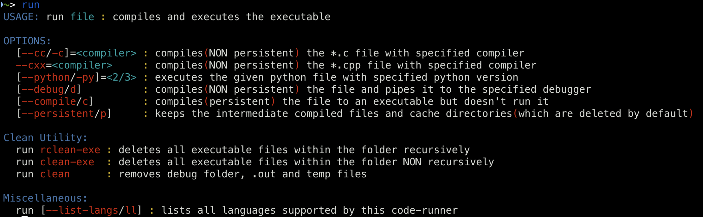

<div id="top"></div>


<!-- PROJECT SHIELDS -->
<!-- https://www.markdownguide.org/basic-syntax/#reference-style-links-->
[![Contributors][contributors-shield]][contributors-url]
[![Forks][forks-shield]][forks-url]
[![Stargazers][stars-shield]][stars-url]
[![Issues][issues-shield]][issues-url]
[![MIT License][license-shield]][license-url]
[![LinkedIn][linkedin-shield]][linkedin-url]


  <h3 align="center">code-runner</h3>

  <p align="center">
    <i>run supported lang files with single command</i>
    <br />
    <a href="https://github.com/proffapt/code-runner"><strong>Explore the docs »</strong></a>
    <br />
    <br />
    <a href="https://github.com/proffapt/code-runner/issues">Report Bug</a>
    ·
    <a href="https://github.com/proffapt/code-runner/issues">Request Feature</a>
  </p>
</div>


<!-- TABLE OF CONTENTS -->
<details>
  <summary>Table of Contents</summary>
  <ol>
    <li>
      <a href="#about-the-project">About The Project</a>
      <ul>
        <li><a href="#built-with">Built With</a></li>
      </ul>
    </li>
    <li>
      <a href="#getting-started">Getting Started</a>
      <ul>
        <li><a href="#installation">Installation</a></li>
      </ul>
    </li>
    <li><a href="#usage">Usage</a></li>
    <li><a href="#integrating-with-vscode">Integrating with vscode</a></li>
    <li><a href="#integrating-with-vim">Integrating with vim</a></li>
    <li><a href="#contributing">Contributing</a></li>
    <li><a href="#changelog">Change.log</a></li>
    <li><a href="#license">License</a></li>
    <li><a href="#contact">Contact</a></li>
    <li><a href="#acknowledgments">Acknowledgments</a></li>
  </ol>
</details>

<!-- ABOUT THE PROJECT -->
## About The Project

This is a script written in bash, which compiles the code file and run it for you and delete other junk files if created during the process of compilation, all this with one command.

<p align="right">(<a href="#top">back to top</a>)</p>

### Built With

This project is made with following langs/frameworks.

* BASH

<p align="right">(<a href="#top">back to top</a>)</p>


<!-- GETTING STARTED -->
## Getting Started

### Installation

_Now since we are done with the setting up of environment suitable for the project to compile/run, let's install and configure the project on your system locally now._

1. Run the following command
_Copy the following commands to perform above mentioned tasks!_
   ```sh
   curl https://raw.githubusercontent.com/proffapt/code-runner/main/setup.sh | bash
   ```
2. Run the code
   ```sh
   run my_code.c
   ```
   OR
   ```sh
   run ~/path/to/my_code.c
   ```

<p align="right">(<a href="#top">back to top</a>)</p>


<!-- USAGE EXAMPLES -->
## Usage

<div align="center">
  <a href="https://github.com/proffapt/code-runner">
    
  </a>
</div>

<div id="integrating-with-vscode"></div>

## Integrating with vscode

Create custom keybindings for vscode to use this script more conveniently in vscode, you can copy my keybindings from [vscode-keybindings](https://github.com/proffapt/code-runner/blob/main/keybindings/vscode-keybindings) into your keybindings.json

* `alt+space` 

	- **If there is no instance of terminal**: Spawns a new terminal `>` shifts the focus to it.
	- **If the instance already exists and focus is on editor pane**: Focuses the terminal.
	- **If the focus is on terminal**: Focuses the editor pane keeping the terminal at it's place.

* `cmd+contextmenu` -- use twice for execution

	- **If there is no terminal instance**: Spawns a new terminal `>` shifts focus to it(DOESN"T EXECUTE THE CODE, press again to execute the code).
	- **If instance exists and focus is on editor pane**: Shifts focus to terminal(DOESN"T EXECUTE THE CODE, press again to execute the code).
	- **If the focus is on terminal**: Executes the code.

	^ **NOTE**: Code execution is also possible even if the code file is not directly inside the folder opened in vscode.

>> _Stores previous execution history, as there is no new terminal created everytime, it's created only when not present else uses the same terminal_

<p align="right">(<a href="#top">back to top</a>)</p>

<div id="integrating-with-vim"></div>

## Integrating with vim

I made a custom keybinding to work with my code-runner on vim, add the lines from [vim-keybindings](https://github.com/proffapt/code-runner/blob/main/keybindings/vim-keybindings) to your vim configuration file

* `rr` 

	- In NORMAL mode: Saves the file `>`  creates a new floaterm buffer `>` shifts focus to it `>` runs the code(CLOSE the buffer with any key after completion of execution).

>> _Doesn't store previous execution history, as there is a new buffer created everytime_

* `ff` 

	- **In NORMAL mode with no existing floaterm buffer**: Saves the file `>` creates a new floaterm buffer `>` shifts focus to it `>` runs the code.
	- **In NORMAL mode with existing floaterm buffer but focus on code buffer**: Saves the file `>` shifts focus to floaterm buffer `>` runs the code.
	- **In NORMAL mode with existing floaterm buffer and focus on flaoterm buffer**: Hides the floaterm buffer `>` focuses on the working file's buffer.
	- **In TERMINAL mode**: Hides active floaterm buffer `>` focuses on the working file's buffer. 

>> _Stores previous execution history, as there is no new buffer created everytime, it's created only when not present else uses the same buffer_


<p align="right">(<a href="#top">back to top</a>)</p>

<!-- CONTRIBUTING -->
## Contributing

Contributions are what make the open source community such an amazing place to learn, inspire, and create. Any contributions you make are **greatly appreciated**.

If you have a suggestion that would make this better, please fork the repo and create a pull request. You can also simply open an issue with the tag "enhancement".
Don't forget to give the project a star! Thanks again!

1. Fork the Project
2. Create your Feature Branch (`git checkout -b feature/AmazingFeature`)
3. Commit your Changes (`git commit -m 'Add some AmazingFeature'`)
4. Push to the Branch (`git push origin feature/AmazingFeature`)
5. Open a Pull Request

<p align="right">(<a href="#top">back to top</a>)</p>


<!-- Changelog -->
# Changelog

## v1.1.5

### Added or Changed
- Added basic support for go-lang.

<p align="right">(<a href="#top">back to top</a>)</p>


<!-- LICENSE -->
## License

Distributed under the BSD-2-Clause License. See `LICENSE.txt` for more information.

<p align="right">(<a href="#top">back to top</a>)</p>


<!-- CONTACT -->
## Contact

Arpit Bhardwaj - [Twitter](https://twitter.com/proffapt) - [Telegram](https://t.me/proffapt) - proffapt@protonmail.com

Company website: [Cybernity](https://cybernity.org) - [CybernityForum](https://cybernity.group)

Project Link: [https://github.com/proffapt/code-runner](https://github.com/proffapt/code-runner)

<p align="right">(<a href="#top">back to top</a>)</p>


<!-- ACKNOWLEDGMENTS -->
## Acknowledgments

* [Choose an Open Source License](https://choosealicense.com)
* [Img Shields](https://shields.io)
* [Bash filename manipulation](https://stackoverflow.com/a/965069)


<p align="right">(<a href="#top">back to top</a>)</p>


<!-- MARKDOWN LINKS & IMAGES -->

[contributors-shield]: https://img.shields.io/github/contributors/proffapt/code-runner.svg?style=for-the-badge
[contributors-url]: https://github.com/proffapt/code-runner/graphs/contributors
[forks-shield]: https://img.shields.io/github/forks/proffapt/code-runner.svg?style=for-the-badge
[forks-url]: https://github.com/proffapt/code-runner/network/members
[stars-shield]: https://img.shields.io/github/stars/proffapt/code-runner.svg?style=for-the-badge
[stars-url]: https://github.com/proffapt/code-runner/stargazers
[issues-shield]: https://img.shields.io/github/issues/proffapt/code-runner.svg?style=for-the-badge
[issues-url]: https://github.com/proffapt/code-runner/issues
[license-shield]: https://img.shields.io/github/license/proffapt/code-runner.svg?style=for-the-badge
[license-url]: https://github.com/proffapt/code-runner/blob/master/LICENSE.txt
[linkedin-shield]: https://img.shields.io/badge/-LinkedIn-black.svg?style=for-the-badge&logo=linkedin&colorB=555
[linkedin-url]: https://linkedin.com/in/proffapt
