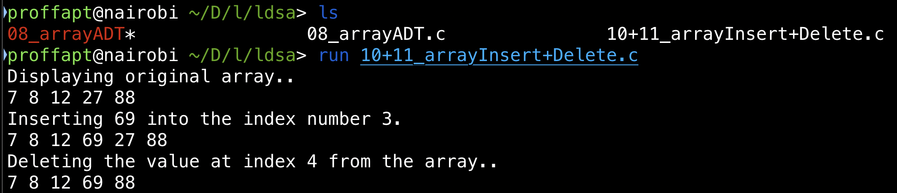

<div id="top"></div>


<!-- PROJECT SHIELDS -->
<!-- https://www.markdownguide.org/basic-syntax/#reference-style-links-->
[![Contributors][contributors-shield]][contributors-url]
[![Forks][forks-shield]][forks-url]
[![Stargazers][stars-shield]][stars-url]
[![Issues][issues-shield]][issues-url]
[![MIT License][license-shield]][license-url]
[![LinkedIn][linkedin-shield]][linkedin-url]


  <h3 align="center">code-runner</h3>

  <p align="center">
    <i>run supported lang files with single command</i>
    <br />
    <a href="https://github.com/proffapt/code-runner"><strong>Explore the docs »</strong></a>
    <br />
    <br />
    <a href="https://github.com/proffapt/code-runner/issues">Report Bug</a>
    ·
    <a href="https://github.com/proffapt/code-runner/issues">Request Feature</a>
  </p>
</div>


<!-- TABLE OF CONTENTS -->
<details>
  <summary>Table of Contents</summary>
  <ol>
    <li>
      <a href="#about-the-project">About The Project</a>
      <ul>
        <li><a href="#built-with">Built With</a></li>
      </ul>
    </li>
    <li>
      <a href="#getting-started">Getting Started</a>
      <ul>
        <li><a href="#prerequisites">Prerequisites</a></li>
        <li><a href="#installation">Installation</a></li>
      </ul>
    </li>
    <li><a href="#usage">Usage</a></li>
    <li><a href="#roadmap">Roadmap</a></li>
    <li><a href="#contributing">Contributing</a></li>
    <li><a href="#changelog">Change.log</a></li>
    <li><a href="#license">License</a></li>
    <li><a href="#contact">Contact</a></li>
    <li><a href="#acknowledgments">Acknowledgments</a></li>
  </ol>
</details>


<!-- ABOUT THE PROJECT -->
## About The Project

This is a script written in bash, which compiles the code file and run it for you and delete other junk files if created during the process of compilation, all this with one command.

<p align="right">(<a href="#top">back to top</a>)</p>

### Built With

This project is made with following langs/frameworks.

* BASH

<p align="right">(<a href="#top">back to top</a>)</p>


<!-- GETTING STARTED -->
## Getting Started

To get a local copy up and running follow these simple steps.

### Prerequisites

You will need to install the following dependencies for the project to work.
* gcc
  ```sh
  sudo apt install -y gcc // DEBIAN based
  brew install gcc // MACos
  sudo pacman -Sy gcc // Arch
  ```

### Installation

_Now since we are done with the setting up of environment suitable for the project to compile/run, let's install and configure the project on your system locally now._

1. Clone the repo
   ```sh
   git clone https://github.com/proffapt/code-runner.git
   ```
2. Make the script executable
   ```sh
   cd ./code-runner
   chmod +x ./crunner
   ```
3. Add the alias to you shell config file
   ```sh
   echo "alias run="path/to/crunner"" >> ~/.SHELL_CONFIG
   source ~/.SHELL_CONFIG
   ```

<p align="right">(<a href="#top">back to top</a>)</p>


<!-- USAGE EXAMPLES -->
## Usage

<div align="center">
  <a href="https://github.com/proffapt/code-runner">
    
  </a>
</div>

<p align="right">(<a href="#top">back to top</a>)</p>


<!-- ROADMAP -->
## Roadmap

- [x] Add the Documentation other then README.md
- [x] Add crunner
- [x] Add support for c and cpp files
- [x] Add the main documentation

See the [open issues](https://github.com/proffapt/code-runner/issues) for a full list of proposed features (and known issues).

<p align="right">(<a href="#top">back to top</a>)</p>


<!-- CONTRIBUTING -->
## Contributing

Contributions are what make the open source community such an amazing place to learn, inspire, and create. Any contributions you make are **greatly appreciated**.

If you have a suggestion that would make this better, please fork the repo and create a pull request. You can also simply open an issue with the tag "enhancement".
Don't forget to give the project a star! Thanks again!

1. Fork the Project
2. Create your Feature Branch (`git checkout -b feature/AmazingFeature`)
3. Commit your Changes (`git commit -m 'Add some AmazingFeature'`)
4. Push to the Branch (`git push origin feature/AmazingFeature`)
5. Open a Pull Request

<p align="right">(<a href="#top">back to top</a>)</p>


<!-- Changelog -->
# Changelog

## v1.0.0

### Added or Changed
- Added this changelog :)
- Added support for C and C++ files.
- Added help menu


### Removed

- Removed the `-f` flag


<!-- LICENSE -->
## License

Distributed under the MIT License. See `LICENSE.txt` for more information.

<p align="right">(<a href="#top">back to top</a>)</p>


<!-- CONTACT -->
## Contact

Arpit Bhardwaj - [Twitter](https://twitter.com/proffapt) - [Telegram](https://t.me/proffapt) - proffapt@protonmail.com

Company website: [Cybernity](https://cybernity.org) - [CybernityForum](https://cybernity.group)

Project Link: [https://github.com/proffapt/code-runner](https://github.com/proffapt/code-runner)

<p align="right">(<a href="#top">back to top</a>)</p>


<!-- ACKNOWLEDGMENTS -->
## Acknowledgments

Use this space to list resources you find helpful and would like to give credit to.

* [Choose an Open Source License](https://choosealicense.com)
* [Img Shields](https://shields.io)
* [Bash filename manipulation](https://stackoverflow.com/a/965069)


<p align="right">(<a href="#top">back to top</a>)</p>


<!-- MARKDOWN LINKS & IMAGES -->

[contributors-shield]: https://img.shields.io/github/contributors/proffapt/code-runner.svg?style=for-the-badge
[contributors-url]: https://github.com/proffapt/code-runner/graphs/contributors
[forks-shield]: https://img.shields.io/github/forks/proffapt/code-runner.svg?style=for-the-badge
[forks-url]: https://github.com/proffapt/code-runner/network/members
[stars-shield]: https://img.shields.io/github/stars/proffapt/code-runner.svg?style=for-the-badge
[stars-url]: https://github.com/proffapt/code-runner/stargazers
[issues-shield]: https://img.shields.io/github/issues/proffapt/code-runner.svg?style=for-the-badge
[issues-url]: https://github.com/proffapt/code-runner/issues
[license-shield]: https://img.shields.io/github/license/proffapt/code-runner.svg?style=for-the-badge
[license-url]: https://github.com/proffapt/code-runner/blob/master/LICENSE.txt
[linkedin-shield]: https://img.shields.io/badge/-LinkedIn-black.svg?style=for-the-badge&logo=linkedin&colorB=555
[linkedin-url]: https://linkedin.com/in/proffapt
